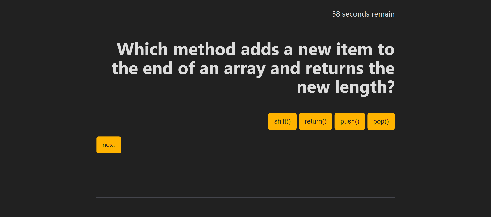

# Code Quiz

## Description
This application is a coding assessment including only multiple-choice questions. With 75 seconds to complete the 5 question quiz, you gain a point for every correct answer and lose 10 seconds for every incorrect answer. There is an opportunity to save your initials and score at the end of the quiz to keep track of the leaderboard on your local machine.

## User Story

```
AS A coding boot camp student
I WANT to take a timed quiz on JavaScript fundamentals that stores high scores
SO THAT I can gauge my progress compared to my peers
```

## Acceptance Criteria

```
GIVEN I am taking a code quiz
WHEN I click the start button
THEN a timer starts and I am presented with a question
WHEN I answer a question
THEN I am presented with another question
WHEN I answer a question incorrectly
THEN time is subtracted from the clock
WHEN all questions are answered or the timer reaches 0
THEN the game is over
WHEN the game is over
THEN I can save my initials and my score
```

## Preview


## Deployed Application
https://cviguers.github.io/code-quiz/
